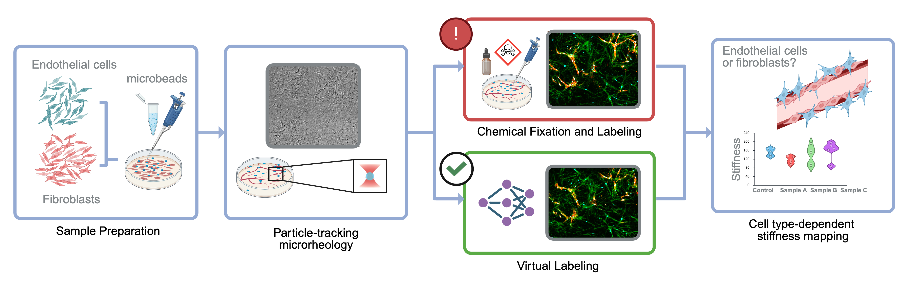
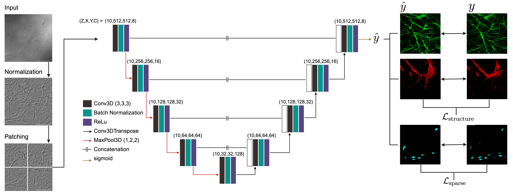

# Virtual fluorescent labeling of engineered vascular networks with embedded tracer particles

This repository implements 3D deep-learning models that predict **virtual fluorescence** from **label-free transmission z-stacks** acquired in fibrin vascular constructs containing **2 µm tracer microbeads**. The models generate three fluorescence targets:

- **DAPI** (nuclei)
- **Phalloidin** (actin / cytoskeleton)
- **UEA I** (endothelial vasculature)

The intended use is longitudinal imaging workflows where fixation and staining would otherwise prevent repeated measurements and where bead-based microrheology requires keeping tracer particles in the sample.

---

## Figures

### Graphical abstract

### Model and pipeline schematic

---

## Input and outputs

### Input
- **Transmission (label-free) 3D TIFF stack**  
  (Z × Y × X or equivalent ordering as produced by microscope export)

### Outputs (one model per target)
- **Virtual DAPI** (single-channel)
- **Virtual Phalloidin** (single-channel)
- **Virtual UEA I** (single-channel)

---

## Repository layout

### `assets/`
Images displayed on the GitHub landing page and referenced in this README:
- `assets/Graphical_abstract.jpeg`
- `assets/Architecture.jpeg`

### `Example/`
Example data demonstrating expected stack formatting: **one TIFF stack per channel**.
- `Example_transmission_stack.tif` — input stack (transmission)
- `Example_DAPI_stack.tif` — target stack (DAPI)
- `Example_Phalloidin_stack.tif` — target stack (phalloidin)
- `Example_UEAI_stack.tif` — target stack (UEA I)

### `metrics/`
Metric scripts used to evaluate prediction quality and channel-specific morphometrics.

- `metrics/__init__.py`  
  Keeps `metrics/` importable as a Python package.

- `metrics/common.py`  
  Shared utilities for metric scripts.

- `metrics/image_quality.py`  
  Image-level similarity metrics (MSE, SSIM, PSNR, correlation, CCC).

- `metrics/line_profile.py`  
  Matched GT vs prediction intensity profiles.

- `metrics/phalloidin_orientation.py`  
  Phalloidin fiber orientation comparison.

- `metrics/ueaI_fp_tiles.py`  
  Vessel-aware false-positive analysis.

- `metrics/ueaI_vessel_density.py`  
  Vessel density comparison.

- `metrics/nuclei_segmentation.py`  
  DAPI segmentation, masks, and Dice/IoU evaluation.

### Root scripts
- `preprocessing.py`
- `train_phalloidin.py`
- `train_UEAI.py`
- `train_dapi.py`

---

## Model summary

- **Architecture:** 3D U-Net encoder–decoder with skip connections.
- **Training:** supervised learning on paired transmission/fluorescence volumes.
- **Loss design:** structure-preserving for phalloidin/UEA I, sparsity-aware for DAPI.

---

## Dependencies

Python 3.x, numpy, scipy, pandas, tifffile, scikit-image, opencv-python, matplotlib, h5py, tensorflow, tensorflow-addons, tqdm.

---

## Citation

**Eldeen, S.**, Guerrero Ramirez, M., Lanterman, B., Chang, P., & Botvinick, E. (2025).  
*Virtual fluorescent labeling of engineered vascular networks with embedded tracer particles.*  
Acta Biomaterialia. In progress.
